# Final Design

For the most part we kept our initial design intact, the names of classes changed and many classes were added and removed, but the main pattern of segregating model, view, and controller into their own interfaces and implementing classes was preserved. Each element had an implementing class and several dependency 'helper' classes that were used by the interface implementing class.

## Model

In our final design the model ended up responsible for managing data, writing to files, the api response, held the records, serialization & deserialization, and some general formatting.

```mermaid
---
title: Model Classes
---
classDiagram

    ParksModel ..|> IModel

    ParksModel ..> FileManager : depends
    ParksModel ..> NetUtils : depends
    ParksModel ..> DisplayParks: depends
    ParksModel ..> ParkDisplayManager: depends
    ParksModel ..> RandomParkSelector: depends
    ParksModel ..> ZipConverter: depends
    ParksModel ..> Records: depends

    class DisplayParks {
        + formatParkListWithSeparators(List<Park>) String
        + formatBasicParkInfo(Park) String
        + formatParkDetails(Park) String
        + getParkSeparator() String
        + formatSavedParkListItem(Park) String
    }
    class FileManager {
        + saveSearchToFile(List<Park>) boolean
        + loadSavedParks() List<Park>
        + loadSavedSearch() List<Park>
        + updateSavedList(List<Park>) void
    }
    class IModel {
        <<Interface>>
        + updateDB(String) boolean
        + updateDB(List<Park>) boolean
        + getParkList() List<Park>
        + getParkByName(String) Park
        + getParksByActivityName(String) List<Park>
        + getFilteredParks(List<String>) List<Park>
        + getParkByParkCode(String) Park
        + getActivityList() List<String>
        + getRandomPark() boolean
    }
    class NetUtils {
        + getParksByState(String) String
        + getListOfActivities() List<String>
        + getParksByZip(String) String
        + getParkByParkCode(String) String
        + getParksByName(String) String
        + downloadImages(Park, int) List<ImageIcon>
    }
    class ParkDisplayManager {
        + updateParkList(List<Park>, DefaultListModel<Park>, JList<Park>, DisplayAreaPanel, JScrollPane, Runnable) DefaultListModel<Park>
        + showParkDetails(Park, DisplayAreaPanel) boolean
        + restoreSummaryView(Park, DefaultListModel<Park>, JList<Park>, DisplayAreaPanel, JScrollPane) void
    }
    class ParksModel {
        + getRandomPark() boolean
        + updateDB(String) boolean
        + updateDB(List<Park>) boolean
        + getParkList() List<Park>
        + getParkByName(String) Park
        + getParksByActivityName(String) List<Park>
        + getFilteredParks(List<String>) List<Park>
        + getParkByParkCode(String) Park
        + getActivityList() List<String
        + setParkList(List<Park>) void
    }
    class RandomParkSelector {
        + getRandomParkCode() String
        + getParkCodes() List<String>
    }
    class Records {
        <<Record>>
        + Park(name: String, states: String, description: String, activities: List<Activity>, addresses: List<Address>, images: List<ParkImage>, parkCode: String)
        + Activity(id: String, name: String)
        + Address(postalCode: String, city: String, stateCode: String, line1: String)
        + ParkImage(title: String, url: String, credit: String)
        + ParkWrapper(data: List<Park>)
        + ActivityWrapper(data: List<Activity>)
    }
    class ZipConverter {
        + convertZipToState(String) String
    }
```

## View
The view will be in charge of managing the frame, swapping components, and creating custom UI elements. There will be a class called `FrameInstance` that holds all the components that are on screen. This means that UI components can be updated by the controller (Via action listeners).

```mermaid
---
title: View Classes
---
classDiagram

    JFrameView ..|> IView : implements

    JFrameView ..> Settings : depends
    JFrameView ..> SearchPanel : depends
    JFrameView ..> ButtonPanel : depends
    JFrameView ..> TextPanel : depends
    JFrameView ..> SavedParksPanel : depends
    JFrameView ..> ImagePanel : depends
    JFrameView ..> LoadingDialog : depends
    JFrameView ..> Selector : depends
    JFrameView ..> ParkListCellRenderer : depends
    JFrameView ..> DisplayAreaPanel : depends
    JFrameView ..> DetailViewPanel : depends

    class Settings {
        + getInstance() Settings
        + loadSettings() void
        + get(String key) String
    }

    class ButtonPanel {
        + addRandomActionListener(ActionListener) void
        + addSaveActionListener(ActionListener) void
        + addLoadActionListener(ActionListener) void
        + addViewDetailActionListener(ActionListener) void
        + addToListActionListener(ActionListener) void
        + addRemoveFromListActionListener(ActionListener) void
        + addFilterActionListener(ActionListener) void
        + addBackActionListener(ActionListener) void
        + enableBackButton(boolean) void
    }
    class DetailViewPanel {
        + setParkDetails(Park) void
    }
    class DisplayAreaPanel {
        + showSummaryView() void
        + showDetailView(Park) void
    }
    class IView {
        <<Interface>>
        + initializeFrame() void
        + getSearchPanel() SearchPanel
        + getButtonPanel() ButtonPanel
        + getTextPanel() TextPanel
        + getSavedParksPanel() SavedParksPanel
        + getImagePanel() ImagePanel
        + promptActivities(List<String>) List<String>
        + promptSaveAction(String) List<String>
        + showLoadingWhileTask(Runnable) void
    }
    class ImagePanel {
        + updateImages(List<ImageIcon>) void
    }
    class JFrameView {
    }
    class LoadingDialog {
        + show(Component, String) void
        + hide() void
    }
    class ParkListCellRenderer {
        + reset() void
        + getListCellRendererComponent(JList<? extends Park>, Park, int, boolean, boolean) Component
    }
    class SavedParksPanel {
        + addPark(Park) boolean
        + updateSavedList(List<Park>) void
        + removeSelectedPark() boolean
        + getSelectedPark() Park
        + getSavedParks() List<Park>
        + clearList() void
    }
    class SearchPanel {
        + getSearchQuery() String
        + addSearchListener(ActionListener) void
    }
    class Selector {
        + showSelector(Component, String, List<String>) List<String>
    }
    class TextPanel {
        + updateResults(List<Park>) void
        + showSelectedParkDetails() void
        + showSummaryListView() void
        + getSelectedPark() Park
    }
```

The controller will be the lightest element of our design, it is mostly in charge of setting the ActionListeners for the view. Here the controller can get a response from the model and instruct the view to display the response.

## Controller

## Complete Diagram 

## Complete Diagram No Methods (Easier to see everything)

```mermaid
---
title: Parks App
---
classDiagram

    ParkExplorer ..> IModel
    ParkExplorer ..> IView
    ParkExplorer ..> IController

    class Settings {
    }


    %% Controller %%

    ParkController ..|> IController
    ParkController ..> IView
    ParkController ..> IModel

    class IController {
        <<Interface>>
    }

    class ParkController {
    }

    %% Model %%

    ParksModel ..|> IModel

    ParksModel ..> FileManager : depends
    ParksModel ..> NetUtils : depends
    ParksModel ..> DisplayParks: depends
    ParksModel ..> RandomParkSelector: depends
    ParksModel ..> ZipConverter: depends
    ParksModel ..> Records: depends

    class IModel {
        <<Interface>>
    }
    class ParksModel {
    }
    class DisplayParks {
    }
    class FileManager {
    }
    class RandomParkSelector {
    }
    class Records {
    }
    class ZipConverter {
    }

    %% View %%
    
    JFrameView ..|> IView

    JFrameView ..> Settings : depends
    JFrameView ..> SearchPanel : depends
    JFrameView ..> ButtonPanel : depends
    JFrameView ..> TextPanel : depends
    JFrameView ..> SavedParksPanel : depends
    JFrameView ..> ImagePanel : depends
    JFrameView ..> LoadingDialog : depends
    JFrameView ..> Selector : depends
    JFrameView ..> ParkListCellRenderer : depends
    JFrameView ..> DisplayAreaPanel : depends
    JFrameView ..> DetailViewPanel : depends

    class ButtonPanel {
    }
    class DetailViewPanel {
    }
    class DisplayAreaPanel {
    }
    class IView {
        <<Interface>>
    }
    class ImagePanel {
    }
    class JFrameView {
    }
    class LoadingDialog {
    }
    class ParkListCellRenderer {
    }
    class SavedParksPanel {
    }
    class SearchPanel {
    }
    class Selector {
    }
    class TextPanel {
    }

    %% Main Program Driver %%

    class ParkExplorer {
    }
```
