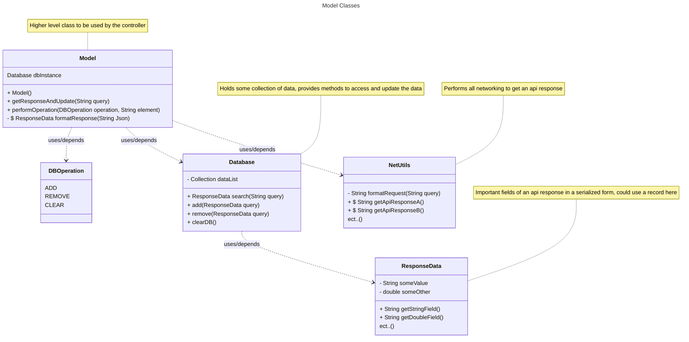
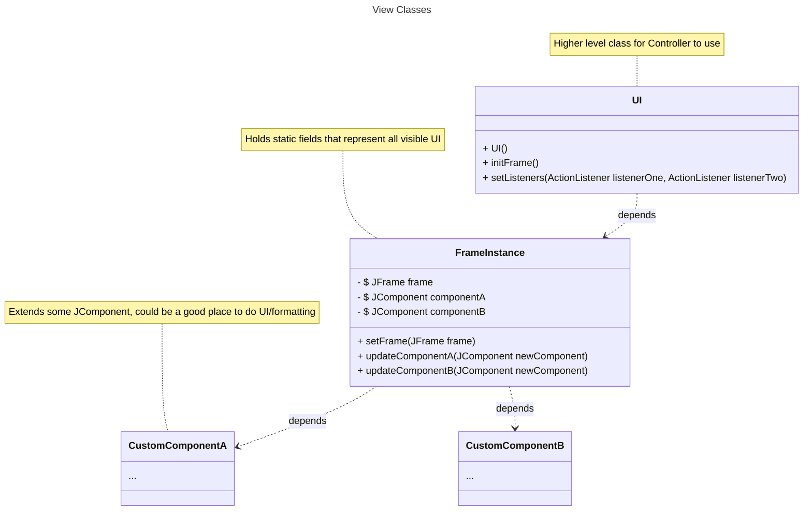

# Initial Design

We will follow model view controller architecture as closely as possible. This means that the UI, user input, Java Swing components will be handled by the View. The controller will process these inputs and hand them off to the model where the business logic will be performed.

## Model

The model will be tasked primarily with receiving the api response, serializing it, ect. It's secondary role will be providing an interface to the database for the controller to add, search, and remove information stored from responses. As a rough outline here are some classes that would make sense to have.

The view will be in charge of managing the frame, swapping components, and creating custom UI elements. There will be a class called `FrameInstance` that holds all the components that are on screen. This means that UI components can be reached and changed from the controller (the listeners will likely want to be there).

The controller will be the lightest element of our design, it's only real task will be setting the ActionListeners for the view to use and passing the appropriate information to the Model.

Controller {

}