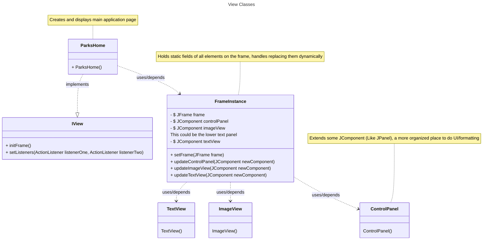

# Initial Design

We will follow model view controller architecture for this project. The UI, user input, and Java Swing components will be handled by the View. The controller will process these inputs and hand them off to the model where the business logic will be performed. The controller will then hand the response to the view to be displayed.

## Model

The model will be tasked primarily with receiving the api response and serializing it. It's secondary role will be providing methods to add, search, filter, and remove information in the database.

## View
The view will be in charge of managing the frame, swapping components, and creating custom UI elements. There will be a class called `FrameInstance` that holds all the components that are on screen. This means that UI components can be updated by the controller (Via action listeners).

The controller will be the lightest element of our design, it is mostly in charge of setting the ActionListeners for the view. Here the controller can get a response from the model and instruct the view to display the response.

## Controller

## Complete Diagram 
