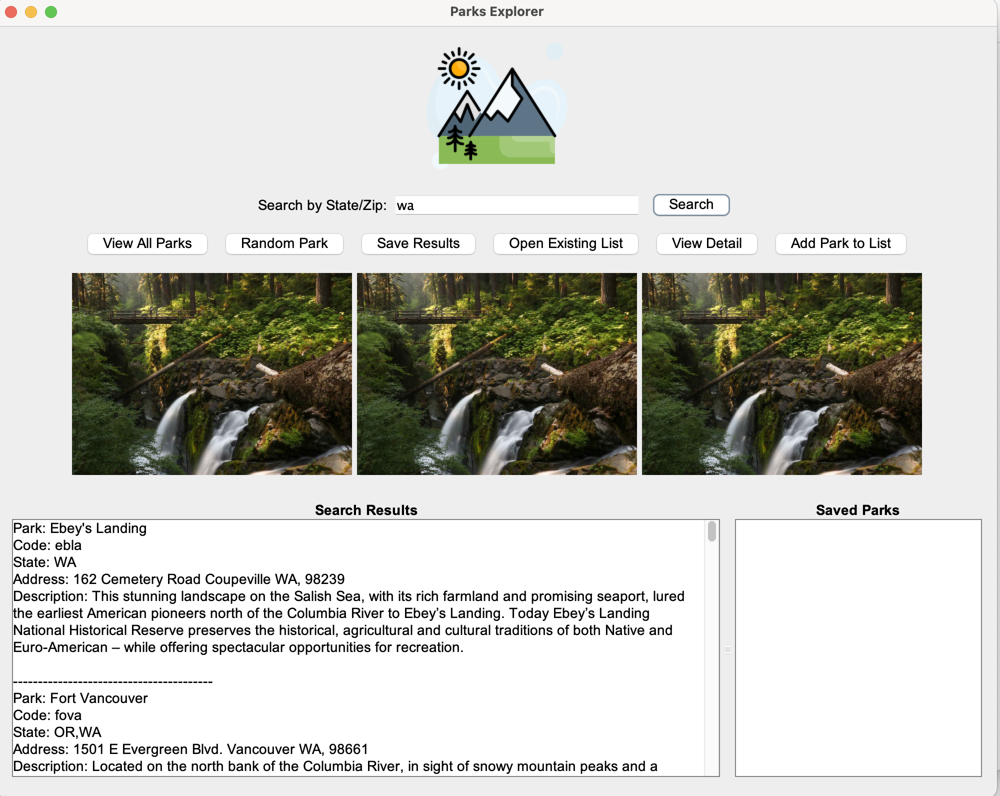
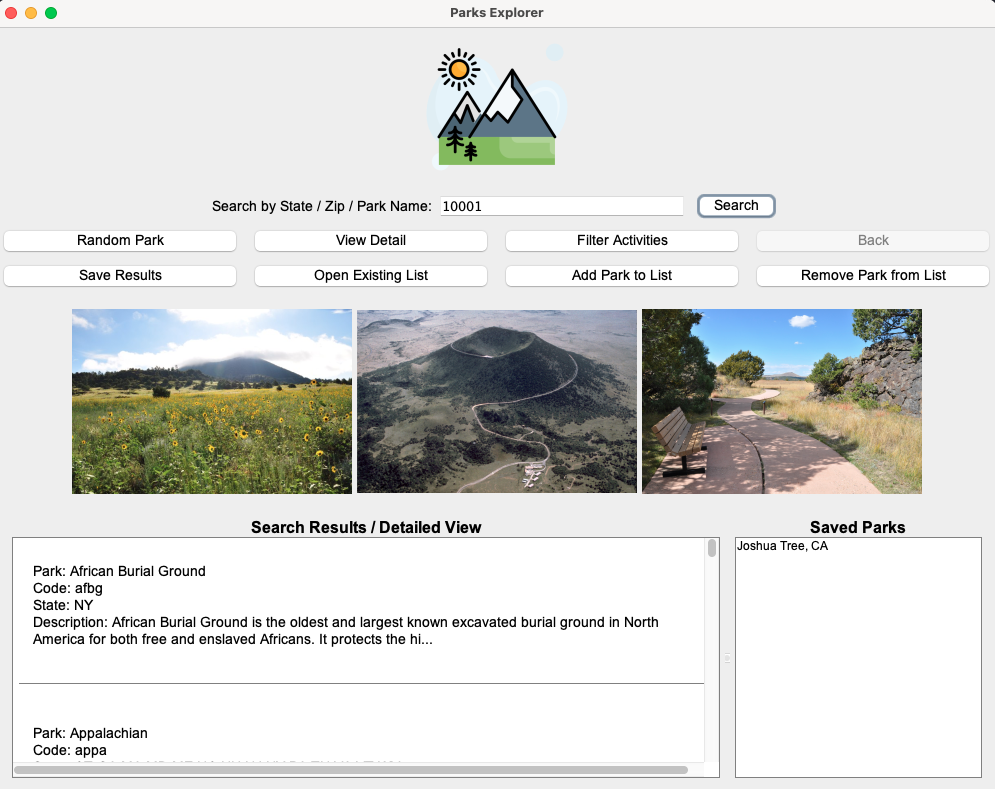
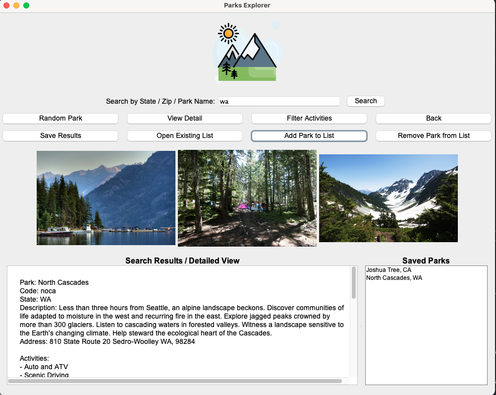
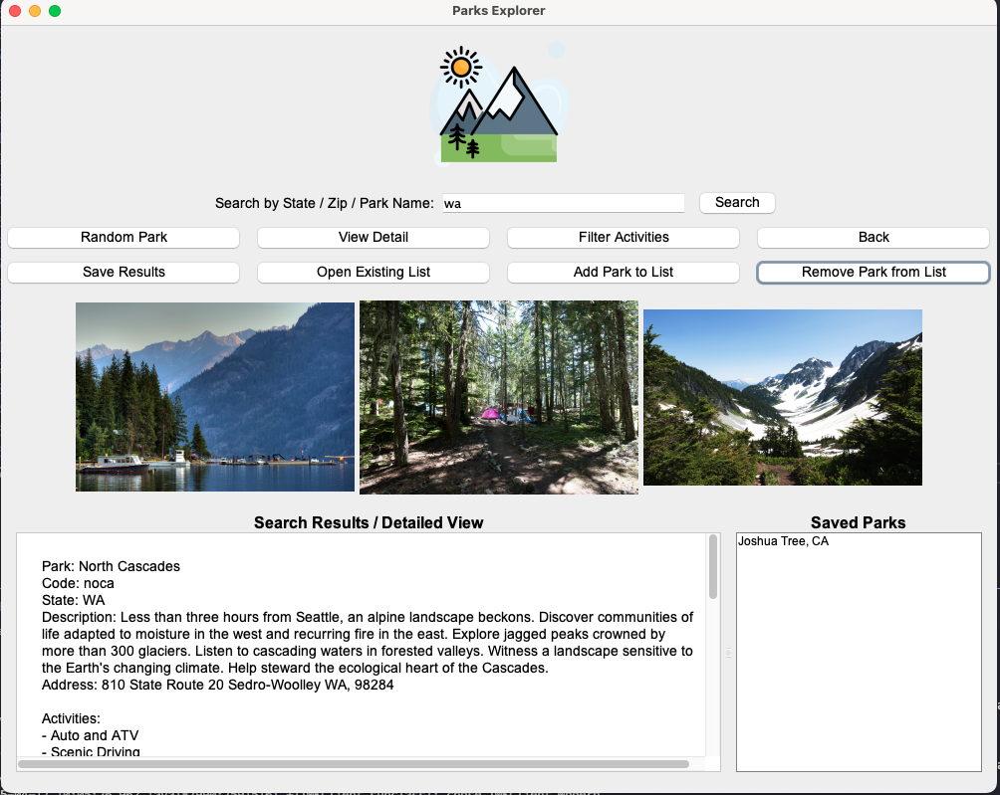
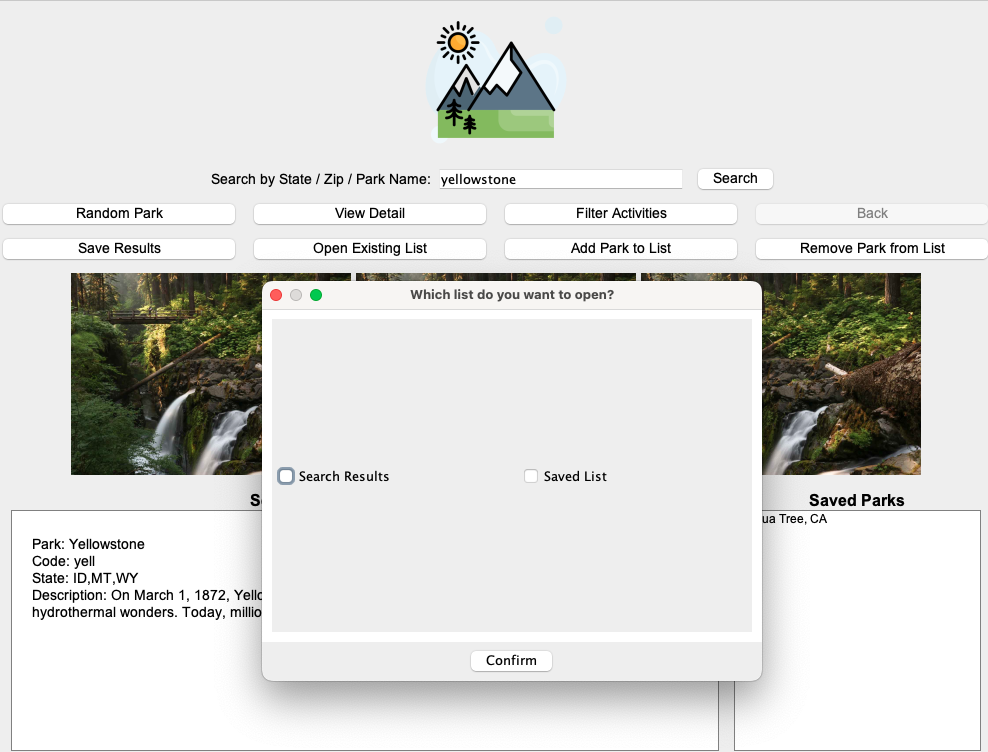

# National Parks Explorer - User Manual

## Table of Contents
- [Introduction](#introduction)
- [Getting Started](#getting-started)
- [Basic Features](#basic-features)
  - [Searching for Parks](#searching-for-parks)
  - [Viewing Park Details](#viewing-park-details)
  - [Using Filters](#using-filters)
- [Advanced Features](#advanced-features)
  - [Saving and Managing Parks](#saving-and-managing-parks)
  - [Opening Saved Lists](#opening-saved-lists)
  - [Random Park Discovery](#random-park-discovery)

## Introduction

National Parks Explorer is an application designed to help you discover and learn about America's national parks. With this tool, you can search for parks by state, zip code, or name, view detailed information about each park, and save your favorite parks for future reference.

## Getting Started
To get started please refer to the SetUp.md so that the application is able to run properly.

https://github.com/Sp25-CS5004-Online-Lionelle/final-project-group-6/blob/main/Manual/SetUp/SetUp.md
## Basic Features

### Searching for Parks

You can search for parks in three different ways:

1. **By State Code**: Enter a two-letter state code (e.g., "WA" for Washington)

   

2. **By Zip Code**: Enter a 5-digit zip code (e.g., "98101" for Seattle)

   

3. **By Park Name**: Enter the full name of a park
   

After entering your search term, click the "Search" button to retrieve results. The search results will appear in the center panel as a selectable list.

### Viewing Park Details

Use the "Back" button to return to the search results list.

### Using Filters

Only parks that offer the selected activities will be displayed in the results.

## Advanced Features

### Saving and Managing Parks

You can create a personalized list of your favorite parks by using the following features:

1. **Adding Parks to Your List**:
From the Search Results display box, you can click on the park that you want to add before then clicking the "Add Park to List" button. This will save the park and display all the saved parks within the "Saved Parks" display box.

   

2. **Removing Parks from Your List**:
Similarly you can also remove any parks from the list by clicking on the park you want to remove in the "Saved Parks" display box and clicking the "Remove Park from List" box.

   

3. **Saving Search Results**:
If you want to save many results at once, you can click on "Save Results" which will save any results in the "Search Results/Detailed View" display box to a json file. If that park is already in the json file, it will not save.

   

### Opening Saved Lists
To open up and view the saved list you can press on "Open Exisiting List" where it will prompt the user about which list they would like to open. Once that is selected and the "confirm" button is pressed, the user is able to view the list of parks they curated.

### Random Park Discovery
Pressing "Random Park" will generate show a random park in th "Search Results/Detailed View" display box.

---

## Tips and Troubleshooting
