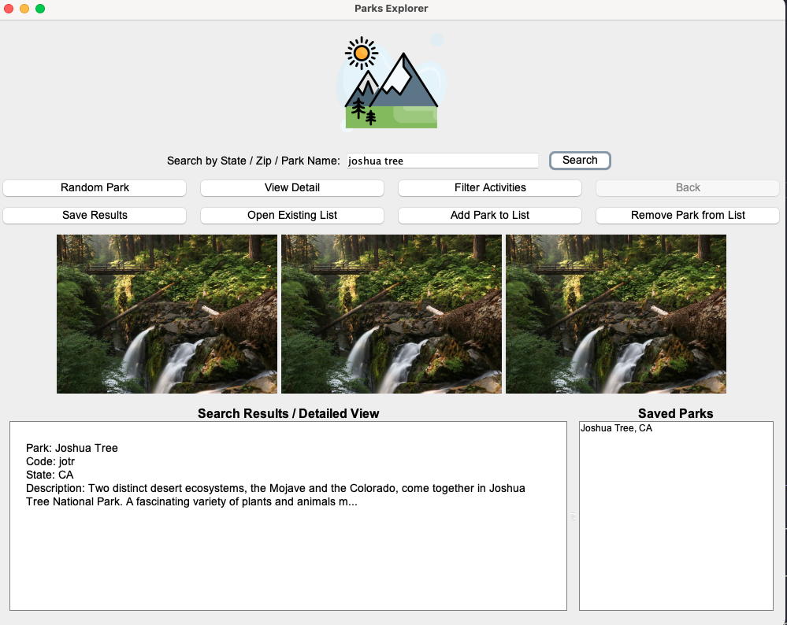
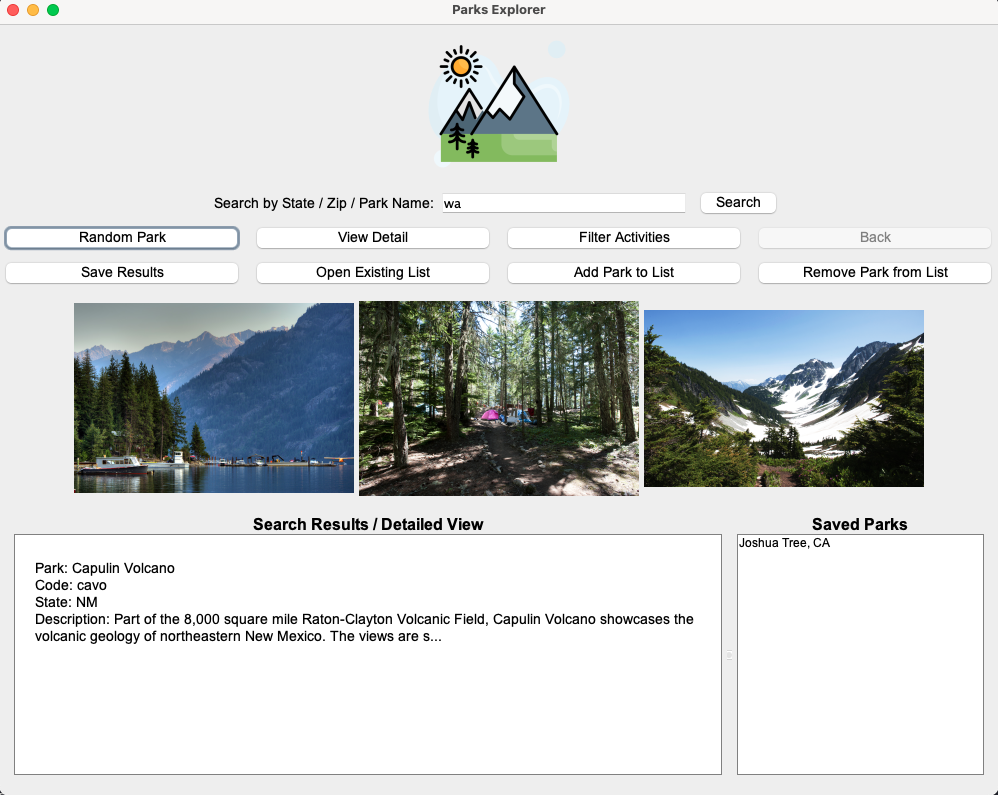

# National Parks Explorer - User Manual

## Table of Contents
- [Introduction](#introduction)
- [Getting Started](#getting-started)
- [Basic Features](#basic-features)
  - [Searching for Parks](#searching-for-parks)
  - [Viewing Park Details](#viewing-park-details)
  - [Using Filters](#using-filters)
- [Advanced Features](#advanced-features)
  - [Saving and Managing Parks](#saving-and-managing-parks)
  - [Opening Saved Lists](#opening-saved-lists)
  - [Random Park Discovery](#random-park-discovery)

## Introduction

National Parks Explorer is an application designed to help you discover and learn about America's national parks. With this tool, you can search for parks by state, zip code, or name, view detailed information about each park, and save your favorite parks for future reference.

## Getting Started

## Basic Features

### Searching for Parks

You can search for parks in three different ways:

1. **By State Code**: Enter a two-letter state code (e.g., "WA" for Washington)

   

2. **By Zip Code**: Enter a 5-digit zip code (e.g., "98101" for Seattle)

   

3. **By Park Name**: Enter the full name of a park
   

After entering your search term, click the "Search" button to retrieve results. The search results will appear in the center panel as a selectable list.

### Viewing Park Details

Use the "Back" button to return to the search results list.

### Using Filters

Only parks that offer the selected activities will be displayed in the results.

## Advanced Features

### Saving and Managing Parks

You can create a personalized list of your favorite parks...

1. **Adding Parks to Your List**:

   

2. **Removing Parks from Your List**:

   

3. **Saving Search Results**:

   

### Opening Saved Lists

### Random Park Discovery

---

## Tips and Troubleshooting
