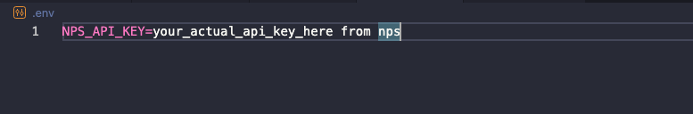

# Setting Up National Parks Explorer

> [!NOTE]
> This application connects to the National Park Service (NPS) API to retrieve real-time data about national parks. To function properly, it requires a personal API key from NPS and a properly configured environment file (.env). The setup below is necessary to ensure the application can authenticate with the NPS servers and display park information.

## 1. Get an NPS API Key

1. Visit the [NPS Developer Resources page](https://www.nps.gov/subjects/developer/get-started.htm)
2. Fill out the API key sign up form :


3. You will receive your API key via email 

## 2. Configure Your Environment
1. Create a file named `.env` in the root directory of the project
   
   **macOS/Linux:**
   ```
   touch .env
   ```
   
   **Windows:**
   ```
   type nul > .env
   ```
> [!IMPORTANT]
> The .env file must be created at the root level for the application to work properly.


2. Add your API key to the file using this format (no quotes):
   ```
   NPS_API_KEY=your_api_key_here
   ```

   
3. Save the file

## 3. Build and Run the Application

### Using Gradle (recommended)

To build and run the application in one step, skipping tests (to save time):

```
gradle build -x test run
```

If you're on Windows, use:

```
gradle.bat build -x test run
```

### Running After Building

If you've already built the application and just want to run it:

```
gradle run
```

If everything was done correctly the main application window should open:


See detailed usage in the [manual](../README.md)

## Troubleshooting

- **API Key Issues**: If you receive errors about invalid API keys, double-check your `.env` file and ensure the key is correctly formatted
- **Gradle Errors**: Make sure you have Java installed (JDK 11 or higher recommended)
- **Build Failures**: Try running with `--stacktrace` flag for more detailed error information:
  ```
  gradle build -x test run --stacktrace
  ```
