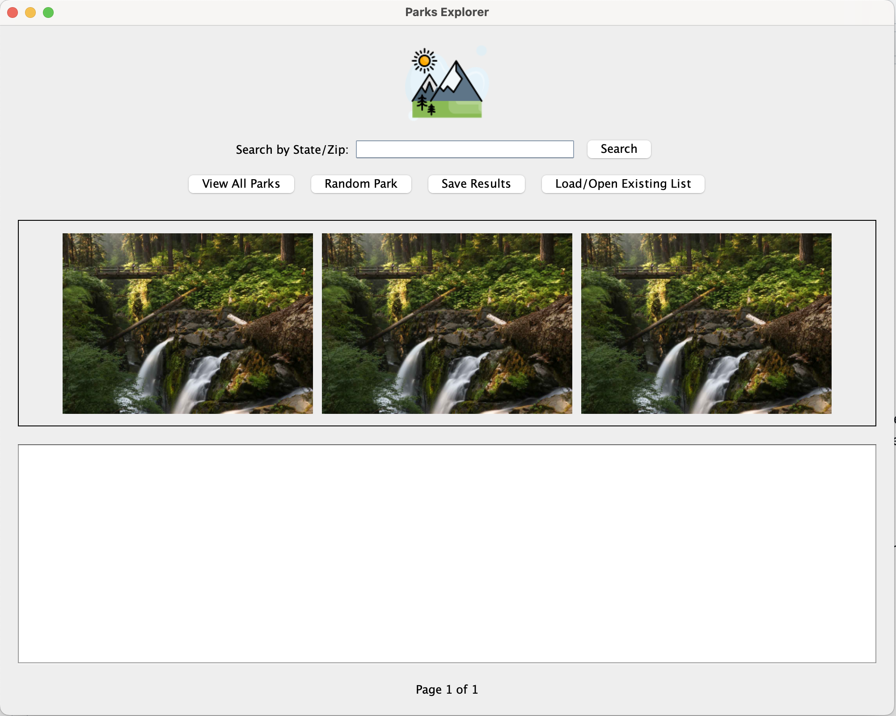

# Park Explorer Project Outline

## Overview
ParkExplorer is a Java desktop application that displays information about National Parks using the National Park Services API. Users can search parks, create lists, and save their favorites.

## Required Features

### 1. Graphical User Interface
- Java Swing/AWT desktop application

### 2. View All Parks
- Display list of all national parks
- Show basic park information (name, location, description)
- Simple scrolling navigation

### 3. Build and Manage Lists
- Create custom park lists through searching by zipcode / state code
- Add/remove parks from lists

### 4. Save Lists
- Save lists in JSON/xml/csv format

## Additional Features

### 1. Park Images
- Display park images
- Basic image gallery view

### 2. API Integration
- Fetch data from National Park Services API
- Basic error handling

### 3. List Management
- Load saved lists
- Edit existing lists
- Filter list/result
### 4. Search and Discovery
- Generate random park suggestions
- Quick "View All Parks" button
- Basic filtering options

## Technical Requirements

### Data Management
- JSON/xml/csv file storage
- Basic search functionality

### API Integration
- National Park Services API
- Basic error handling
- Response caching

### Initial Design and Wireframe:

