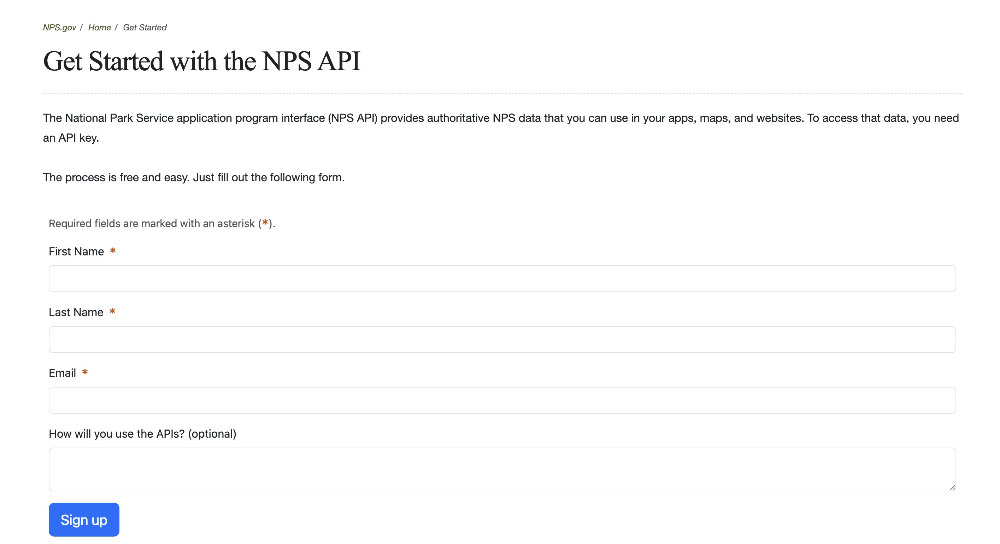
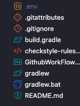

# National Parks Explorer - Final Project for CS 5004 

## Members

George Lin - https://github.com/lingeorge88

Tyler Grozenski - https://github.com/tgrozenski

Tamiyoo Desir - https://github.com/TamiyooD

Hsuan Lee - https://github.com/hsuanlee213

## Application Name and Description

Our Application's name is National Park Explorer.  Utilizing a national park API our group was able to construct a program that allows the user to search for national parks based on various factors such as Zipcode, Name, State. Using these searches the user is then able to manipulate the results by using the various buttons to either add and remove parks from a list, save all the search results, generate a random park, view the details of said park, filter activities, etc.

## Design Documents and Manual

* Design Document - https://github.com/Sp25-CS5004-Online-Lionelle/final-project-group-6/tree/main/DesignDocuments
* Manual - https://github.com/Sp25-CS5004-Online-Lionelle/final-project-group-6/blob/main/Manual/README.md

## Setup and Run Instructions

### 1. Register for an NPS API Key

1. Visit the [NPS Developer Resources page](https://www.nps.gov/subjects/developer/get-started.htm)
2. Fill out the API key sign up form to register for the api key that will be used for this application



3. You will receive your API key via email 

### 2. Configure Your Environment
1. Create a file named `.env` in the root directory of the project
   
   **macOS/Linux:**
   ```
   touch .env
   ```
   
   **Windows:**
   ```
   type nul > .env
   ```
   > [!IMPORTANT]
   > The .env file must be created at the root level for the application to work properly.



2. Add your API key to the file using this format (no quotes):
   ```
   NPS_API_KEY=your_api_key_here
   ```
3. Save the file

### 3. Build and Run the Application

#### Using Gradle (recommended)

To build and run the application in one step, skipping tests (to save time):

```
gradle build -x test run
```

If you're on Windows, use:

```
gradle.bat build -x test run
```

#### Running After Building

If you've already built the application and just want to run it:

```
gradle run
```

**See the Detailed [Manual](./Manual/README.md) for application features and use.**

### Troubleshooting

- **API Key Issues**: If you receive errors about invalid API keys, double-check your `.env` file and ensure the key is correctly formatted
- **Gradle Errors**: Make sure you have Java installed (JDK 11 or higher recommended)
- **Build Failures**: Try running with `--stacktrace` flag for more detailed error information:
  ```
  gradle build -x test run --stacktrace
  ```

